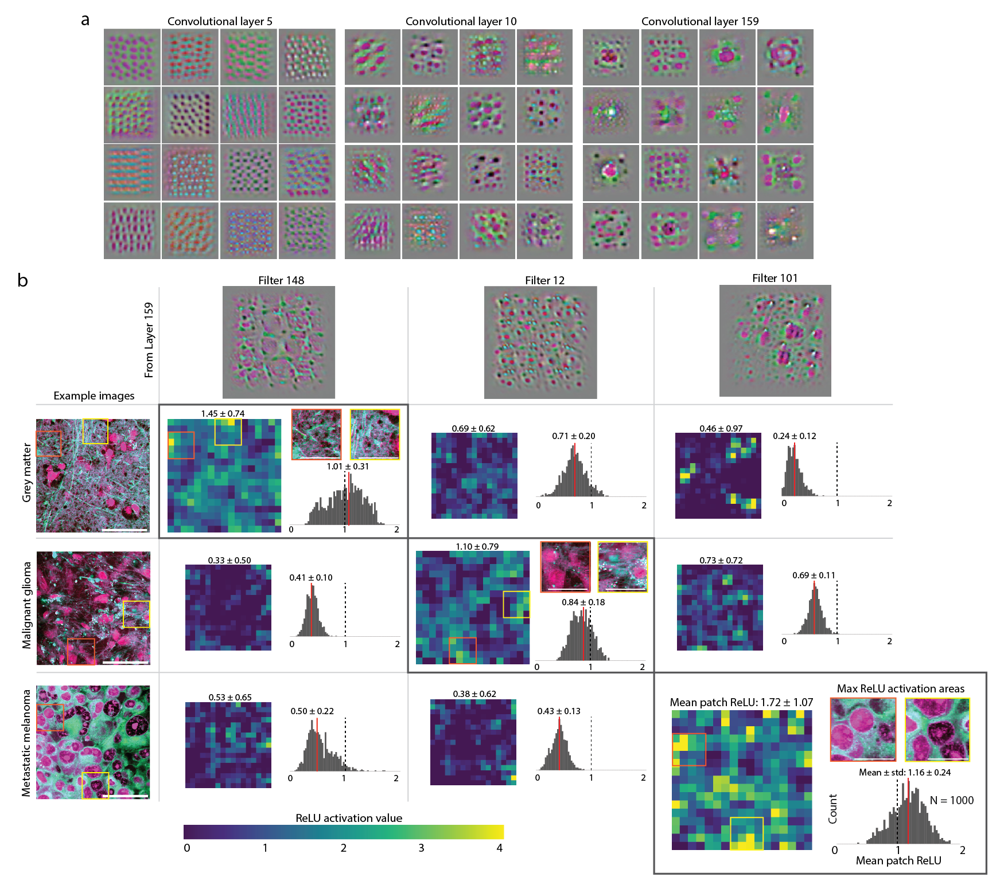
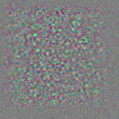
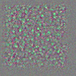
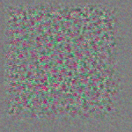
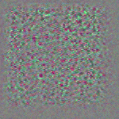
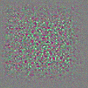

# DeepSRH

Code repository for our paper titled "Near real-time intraoperative brain tumor diagnosis using stimulated Raman histology and deep neural networks" published in *Nature Medicine*, January 2020

_Paper abstract_  Intraoperative diagnosis is essential for providing safe and effective care during cancer surgery. The existing workflow for intraoperative diagnosis based on hematoxylin and eosin-staining of processed tissue is time-, resource-, and labor-intensive. Moreover, interpretation of intraoperative histologic images is dependent on a contracting, unevenly distributed pathology workforce. Here, we report a parallel workflow that combines stimulated Raman histology (SRH), a label-free optical imaging method, and deep convolutional neural networks (CNN) to predict diagnosis at the bedside in near real-time in an automated fashion. Specifically, our CNN, trained on over 2.5 million SRH images, predicts brain tumor diagnosis in the operating room in under 150 seconds, an order of magnitude faster than conventional techniques (e.g., 20-30 minutes). In a multicenter, prospective clinical trial (n = 278) we demonstrated that CNN-based diagnosis of SRH images was non-inferior to pathologist-based interpretation of conventional histologic images (overall accuracy, 94.6% vs. 93.9%). Our CNN learned a hierarchy of recognizable histologic feature representations to classify the major histopathologic classes of brain tumors. Additionally, we implemented a semantic segmentation method to identify tumor infiltrated, diagnostic regions within SRH images. These results demonstrate how intraoperative cancer diagnosis can be streamlined, creating a complimentary pathway for tissue diagnosis that is independent of a traditional pathology laboratory. 

# Results 

## Intraoperative diagnostic pipeline using SRH and deep learning 

## Prospective clinical trial of SRH plus CNN versus conventional H&E histology 

## Activation maximization reveals a hierarchy of learned SRH feature representations 

<!--  -->

  
  
  
  
  

